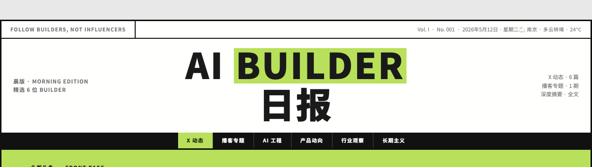
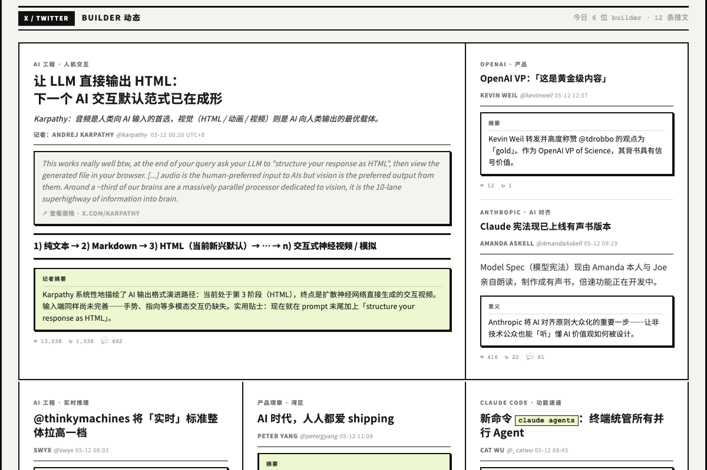
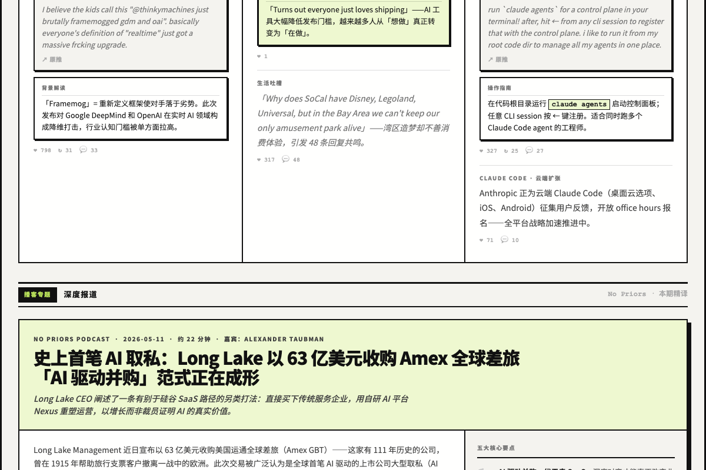

# Follow Builders Daily 📰

> 把 [Follow Builders](https://github.com/zarazhangrui/follow-builders) 的纯文字摘要，变成一份**报纸风格的 HTML 日报**。

每天一份，像看报纸一样刷硅谷 AI 资讯——报头、头版头条、30 秒速览、Builder 分栏卡片、播客深度专题，浏览器直接打开，可阅读、可截图、可分享。


---

## ⚠️ 重要：这是一个「增强插件」，需要安装两个 Skill

这个 Skill **不能单独工作**。它是原版 Follow Builders 的**输出增强层**——

| | 负责什么 | 谁提供 |
|---|---|---|
| **原版 follow-builders** | 抓取数据 + 文字摘要 | [@zarazhangrui](https://github.com/zarazhangrui/follow-builders) |
| **follow-builders-daily（本仓库）** | 把文字排成报纸 HTML | 你正在看的这个 |

打个比方：

- 只装**原版** → 你每天得到一段**纯文字摘要**（发到 Telegram / 终端）
- 只装**本 Skill** → ❌ 没有数据源，跑不起来
- **两个都装** → 你每天得到一份**排版精美的报纸 HTML** ✅

> 简单说：原版是「食材 + 切配」，本 Skill 是「摆盘」。没有食材，光有摆盘的盘子是空的。

---

## 🔄 它是怎么运转的

```
┌─────────────────────────────────────────────────────────────┐
│  原版 follow-builders skill                                   │
│                                                               │
│  ① prepare-digest.js                                          │
│     从中心化 feed 拉取数据（一次 HTTP 请求，无需 API Key）     │
│         ↓                                                     │
│     JSON { x: [...推文], podcasts: [...], prompts: {...} }    │
└─────────────────────────────────────────────────────────────┘
                          ↓
┌─────────────────────────────────────────────────────────────┐
│  follow-builders-daily skill（本仓库）                        │
│                                                               │
│  ② 内容 Remix                                                 │
│     用原版的 prompts 把推文/播客摘要成中文                     │
│         ↓                                                     │
│  ③ 选题决策                                                   │
│     选头条 · 挑 30 秒速览 · 选每日金句 · 提取标签             │
│         ↓                                                     │
│  ④ 组装 HTML                                                  │
│     按 templates/base.html 骨架 + components.md 组件手册       │
│     把内容填进报纸版面（头条用 span-2，其余分栏排列）          │
│         ↓                                                     │
│  ⑤ 输出 + 打开                                                │
│     写入 HTML 文件 → 浏览器自动打开                            │
└─────────────────────────────────────────────────────────────┘
```

**关键点：数据和摘要逻辑全部来自原版，本 Skill 只负责「最后一公里的排版」。**
这样设计的好处是——Zara 在中心化 feed 里更新 builder 列表 / 数据源时，你**自动跟上**，不用手动同步。

---

## 📦 安装

### 第 1 步：安装原版 follow-builders（必须）

```bash
git clone https://github.com/zarazhangrui/follow-builders.git ~/.claude/skills/follow-builders
cd ~/.claude/skills/follow-builders/scripts && npm install
```

首次使用先在 Claude Code 里完成原版的引导设置（语言、推送方式等）：

```
初始化 follow builders
```

> 选「中文」语言，推送方式选「在终端显示 / stdout」即可（本 Skill 会接管输出）。

### 第 2 步：安装本 Skill（follow-builders-daily）

```bash
git clone https://github.com/<你的用户名>/follow-builders-daily.git ~/.claude/skills/follow-builders-daily
```

无需 `npm install`，本 Skill 没有额外依赖。

### 第 3 步：验证两个都装好了

```bash
ls ~/.claude/skills/follow-builders/scripts/prepare-digest.js   # 原版（数据源）
ls ~/.claude/skills/follow-builders-daily/SKILL.md              # 本 Skill（排版）
```

两个文件都存在 = 安装完成。

---

## 🚀 使用

在 Claude Code 中，任意目录下说：

```
生成日报
```

也可以说：「今日日报」「来份报纸」「daily」「newspaper」。

Claude 会自动：
1. 调用原版脚本拉取今日数据
2. Remix 内容为中文
3. 组装报纸 HTML
4. 在浏览器中打开

输出文件默认在：

```
~/cola/outputs/follow-builders-daily/
├── index.html        ← 最新一期（每次覆盖）
└── 2026-06-01.html   ← 按日期归档
```

---

## 📄 日报包含什么

| 版块 | 内容 | 截图 |
|------|------|------|
| **报头 Masthead** | 刊名、期号、日期、天气、版次 |  |
| **头版头条** | 今天最重要的事，lime 绿横幅 | — |
| **30 秒速览** | 3 条一句话核心信息 | — |
| **每日金句** | 从推文里挑的最佳引用 | — |
| **主编按语 + 标签** | 串联叙述 + 话题标签 | — |
| **Builder 卡片网格** | 头条占两列，其余分栏 |  |
| **播客深度专题** | 1 小时播客压缩成 3 分钟，首字下沉 + 五大要点 |  |

---

## 🗂 文件结构

```
follow-builders-daily/
├── SKILL.md                 # Skill 定义 + 完整工作流程（Claude 读这个）
├── templates/
│   ├── base.html             # HTML + CSS 模板（带 {{占位符}} 的报纸骨架）
│   └── components.md         # 组件手册：8 种 HTML 模式 + 网格排列规则
├── examples/
│   └── 2026-05-12.html       # 一份完整的日报示例
├── assets/                   # README 用的预览截图
└── README.md
```

### 三个核心文件的分工

- **`SKILL.md`** —— Claude 的「操作手册」。定义了从拿数据到出 HTML 的 6 个步骤。
- **`templates/base.html`** —— 报纸的「空白模板」。包含全部 CSS 样式和版面骨架，动态内容处用 `{{LEAD_HEADLINE}}` 这样的占位符标记。
- **`templates/components.md`** —— 报纸的「积木说明书」。告诉 Claude 每种卡片（头条版 / 普通版 / 小稿版 / 播客专题）的 HTML 长什么样、什么时候用哪种。

---

## 🎨 设计语言

- **Neo-Brutalism**：黑色粗边框（2px）+ 硬阴影（`4px 4px 0 #000`）+ lime 绿强调色（`#b8e05a`）
- **报纸排版**：CSS Grid 分栏，头条 `span-2` 占两列，重要的内容物理上就更大
- **信息层次**：大标题 > 小稿 > 摘要框，扫一眼就知道今天什么最重要
- **中文友好**：Google Fonts 的 Noto Sans SC，无需本地字体

---

## ❓ FAQ

**Q：为什么不把原版打包进来，让用户只装一个？**
A：因为 builder 列表和数据源是 Zara 中心化维护的，会持续更新。依赖原版能自动跟上最新数据源；自己 fork 一份很快就过时了。本 Skill 只贡献排版价值，不重复造数据轮子。

**Q：日报能自动每天推送吗？**
A：HTML 文件无法在 Telegram 里直接渲染。当前是「本地生成 + 浏览器打开」模式。如果配了原版的 Telegram/Email，本 Skill 可以额外发一条文字通知提醒你去看。

**Q：能改设计风格 / 颜色吗？**
A：可以。编辑 `templates/base.html` 里的 `:root` CSS 变量（`--lime`、`--black` 等），或调整 `components.md` 里的组件结构。

**Q：每天的 builder 数量不一样，版面会乱吗？**
A：不会。`components.md` 定义了网格排列规则——头条固定 span-2，其余每 3 个一行，最后一行不足 3 个就留白。Claude 会按规则自适应排列。

---

## 🙏 致谢

- **理念和数据源**：[张咋啦 @zarazhangrui](https://github.com/zarazhangrui/follow-builders) ——「Follow Builders, Not Influencers」
- **报纸排版设计**：本仓库作者

## License

MIT
