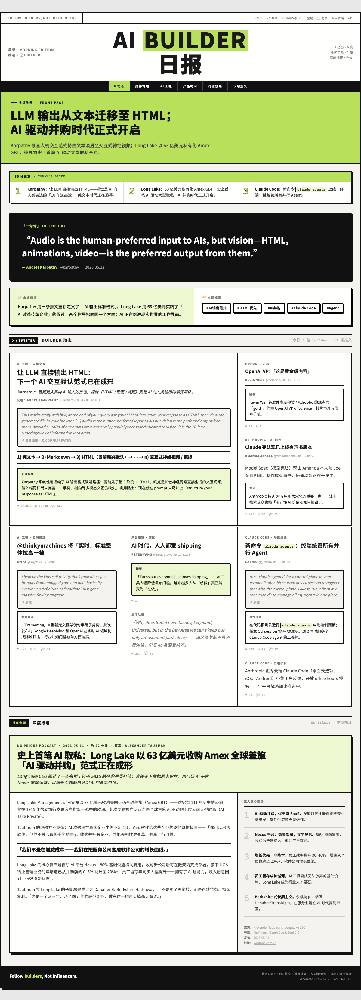

<p align="right">
  <b>中文</b> · <a href="README.en.md">English</a>
</p>

# Follow Builders Daily 📰

> 把 [Follow Builders](https://github.com/zarazhangrui/follow-builders) 的纯文字摘要，变成一份**报纸风格的 HTML 日报**。

每天一份，像看报纸一样刷硅谷 AI 资讯——报头、头版头条、30 秒速览、Builder 分栏卡片、播客深度专题，浏览器直接打开，可阅读、可截图、可分享到小红书 / 朋友圈。



---

## 💡 先用一句话理解它

> **原版 Follow Builders 给你「一段文字」，这个插件把它变成「一张报纸」。**

它本身不抓数据、不写摘要，只做一件事——**把原版输出的内容，排成一份好看的报纸 HTML**。

所以它必须和原版搭配使用。下面会手把手教你怎么装，**完全没装过 skill 也能跟着做**。

---

## ⚠️ 最重要的一件事：你需要安装「两个」Skill

| | 它负责什么 | 来自谁 |
|---|---|---|
| **① 原版 follow-builders** | 抓数据 + 写文字摘要（核心引擎） | [@zarazhangrui](https://github.com/zarazhangrui/follow-builders) |
| **② follow-builders-daily（本仓库）** | 把文字排成报纸 HTML（外观皮肤） | 本仓库 |

- 只装 **①** → 你得到一段**纯文字**摘要 📝
- 只装 **②** → ❌ **跑不起来**，因为没有数据来源
- **① + ② 都装** → 你得到一份**报纸 HTML** 📰 ✅

> 打个比方：**原版是做菜的厨房（食材+烹饪），本插件是摆盘的盘子。** 没有厨房，光有盘子端不出菜。

---

## 🧩 它到底是怎么运转的

```
┌──────────────────────────────────────────────────────────────┐
│  ① 原版 follow-builders（厨房）                                │
│                                                                │
│   prepare-digest.js 脚本                                       │
│   └─ 从中心化 feed 拉取今日数据（一次 HTTP 请求，无需 API Key） │
│        ↓                                                       │
│      JSON 数据 { 推文[], 播客[], 摘要指令{} }                  │
└──────────────────────────────────────────────────────────────┘
                          ↓  把数据交给插件
┌──────────────────────────────────────────────────────────────┐
│  ② follow-builders-daily（摆盘）                               │
│                                                                │
│   1. 用原版的指令把推文/播客摘要成中文                          │
│   2. 选出头条、30 秒速览、每日金句、话题标签                    │
│   3. 按报纸模板组装 HTML（头条占两列，其余分栏排列）            │
│   4. 写入文件 → 浏览器自动打开                                  │
└──────────────────────────────────────────────────────────────┘
```

**为什么要这样拆成两个、而不是合并成一个？**
因为原版的 builder 名单、数据源是张咋啦在云端**持续更新**的。本插件依赖原版，就能**自动用上最新的数据源**，永远不会过时。本插件只专心做好「排版」这一件事。

---

## 📦 安装教程（手把手，零基础可跟）

> **前提**：你已经在电脑上装好了 [Claude Code](https://docs.claude.com/claude-code)。
> Skill 都放在 `~/.claude/skills/` 这个文件夹里，每个 skill 是一个子文件夹。

### 第 1 步：装原版 follow-builders（数据引擎，必装）

打开终端（Terminal），复制粘贴运行：

```bash
git clone https://github.com/zarazhangrui/follow-builders.git ~/.claude/skills/follow-builders
cd ~/.claude/skills/follow-builders/scripts && npm install
```

> 这一步会下载原版 skill，并安装它需要的依赖。`npm install` 跑完没报红色 error 就算成功。

### 第 2 步：装本插件 follow-builders-daily（报纸皮肤）

```bash
git clone https://github.com/hututu-ai/follow-builders-daily.git ~/.claude/skills/follow-builders-daily
```

> 本插件**不需要** `npm install`，没有任何额外依赖，下载完就好。

### 第 3 步：检查两个都装好了

```bash
ls ~/.claude/skills/follow-builders/scripts/prepare-digest.js && \
ls ~/.claude/skills/follow-builders-daily/SKILL.md && \
echo "✅ 两个 skill 都装好了！"
```

看到 `✅ 两个 skill 都装好了！` 就成功了。

### 第 4 步：初始化原版（只需做一次）

打开 Claude Code，在对话框里输入：

```
初始化 follow builders
```

它会用对话的方式问你几个问题，**这样选就行**：

| 它问什么 | 你怎么选 |
|---|---|
| 推送频率 | 每日（daily） |
| 语言 | **中文**（zh） |
| 推送方式 | **在终端显示 / stdout**（让插件接管输出） |

> 不用编辑任何配置文件，跟着对话点选即可。设置完它可能会先发一份纯文字摘要给你——这是正常的，说明原版引擎通了。

### 第 5 步：生成你的第一份报纸 🎉

还是在 Claude Code 对话框里，输入：

```
生成日报
```

等一两分钟，它会自动拉数据、排版、然后**在浏览器里弹出一份报纸**。

生成的文件在这里：

```
~/cola/outputs/follow-builders-daily/
├── index.html        ← 最新一期（每次覆盖）
└── 2026-06-01.html   ← 按日期归档，不会丢
```

---

## 🚀 之后每天怎么用

装好之后，以后只要在 Claude Code 里说一句就行：

```
生成日报
```

也认这些说法：「今日日报」「来份报纸」「daily」「newspaper」。

---

## 📬 邮件订阅（把报纸发到你邮箱）

不想每次都开浏览器？可以让它**把报纸直接发到你邮箱**——邮件客户端能渲染 HTML，收件箱里就是一份排版完整的报纸。📰

**怎么开启：**

1. 在 Claude Code 里说一句：`把投递方式改成邮件`
   原版 follow-builders 会引导你注册一个**免费**的 [Resend](https://resend.com) key（每天 100 封，绰绰有余），并填入你的收件邮箱。
2. 配好后，以后说：`生成日报并发到邮箱`，报纸就会发到你的收件箱。

> 邮箱配置和 key 都复用原版的（存在 `~/.follow-builders/`），不用重复设置。

**想每天自动收到？**
真正的「每天定时自动到达」需要一个定时器到点唤起生成。因为报纸的排版组装依赖 Claude，纯 shell 的定时任务做不了，需要能定时唤起 agent 的工具（如 OpenClaw 的 cron、或支持定时触发的调度方案）。没有调度器时，保持「每天手动说一句」也能收到。

> ⚠️ 小提醒：不同邮件客户端对 HTML/CSS 的支持有差异，极个别老旧客户端可能样式略有出入；主流客户端（Gmail、Apple Mail、Outlook 网页版）渲染良好。
> 用 Resend 免费测试发件域时，只能发给你**账号本人**的邮箱（「发给自己」完全够用）；验证自有域名后可发给任意地址。

---

## 📄 一份日报长什么样

| 版块 | 内容 |
|------|------|
| **报头 Masthead** | 刊名、期号、日期、天气、版次 |
| **头版头条** | 今天最重要的事，lime 绿横幅，5 秒抓住重点 |
| **30 秒速览** | 3 条一句话核心信息，没空细读就扫这三行 |
| **每日金句** | 从推文里挑的最精彩一句，黑底白字 |
| **主编按语 + 标签** | 串联今天的主题 + 话题标签 |
| **Builder 卡片网格** | 头条占两列，其余分栏，重要的物理上就更大 |
| **播客深度专题** | 1 小时播客压缩成 3 分钟，首字下沉 + 五大要点 |

---

## 🆕 更新日志

这个项目会长期维护、持续更新。每次新增了什么，都直接写在这里 👇

### v1.2.0 · 2026-06-02 ｜ 🧭 导航栏交互增强
- 报纸顶部的导航栏从「纯装饰」升级为**真正能用的导航**：
  - **平滑滚动**：点导航项丝滑滑到对应板块。
  - **吸顶固定**：往下滚时导航栏黏在顶部，随时可点。
  - **滚动高亮**：滚到哪个板块，导航项和板块标题栏自动亮绿（IntersectionObserver）。
- 导航栏只显示**真实存在的板块**（X 动态 / 播客专题），没内容的不再硬塞。
- 感谢社区贡献者 [@1480735780](https://github.com/hututu-ai/follow-builders-daily/issues/1) 提出的完整方案 🙏

### v1.1.0 · 2026-06-02 ｜ 📬 邮件订阅
- 现在可以把生成的报纸**直接发到你的邮箱**——邮件客户端能渲染 HTML，收件箱里就是一份排版完整的报纸。
- **用法**：在 Claude Code 说「把投递方式改成邮件」，配好免费的 [Resend](https://resend.com) key + 收件邮箱；之后说「生成日报并发到邮箱」即可。
- 新增零依赖脚本 `scripts/send-email.mjs`，复用原版 follow-builders 已有的邮箱配置（`RESEND_API_KEY` + `delivery.email`），无需重复设置。

### v1.0.0 · 2026-06-01 ｜ 🎉 首次发布
- 把 Follow Builders 的纯文字摘要，变成一份**报纸风格的 HTML 日报**。
- 包含版块：报头 · 头版头条 · 30 秒速览 · 每日金句 · 主编按语 + 标签 · Builder 分栏卡片 · 播客深度专题。
- 零依赖，字体用 Google Fonts（不依赖本地字体），跨设备可移植。
- 完整中英双语 README + 零基础手把手安装教程。

> 想下载某个历史版本的源码？去 [Releases](https://github.com/hututu-ai/follow-builders-daily/releases) 页面。

---

## 🗂 文件结构（想自己改的人看）

```
follow-builders-daily/
├── SKILL.md                 # Claude 的操作手册：从拿数据到出 HTML 的完整步骤
├── templates/
│   ├── base.html             # 报纸的「空白模板」：全部 CSS + 版面骨架 + {{占位符}}
│   └── components.md         # 「积木说明书」：每种卡片的 HTML 长什么样、何时用
├── scripts/
│   └── send-email.mjs        # 邮件投递：把报纸 HTML 发到邮箱（零依赖，复用原版邮箱配置）
├── examples/
│   └── 2026-05-12.html       # 一份完整的日报示例，打开就能看效果
├── assets/                   # README 用的预览截图
└── README.md
```

**想改设计？**
- 改颜色 / 字体 → 编辑 `templates/base.html` 里 `:root` 的 CSS 变量（`--lime`、`--black` 等）
- 改版面结构 → 编辑 `templates/components.md` 里的组件 HTML

---

## ❓ 常见问题

**Q：我能不能只装你这一个，不装原版？**
A：不能。本插件没有数据来源，必须靠原版抓数据。这也是故意的设计——原版的数据源由张咋啦在云端维护更新，依赖它你就能一直用上最新名单，不用自己折腾。

**Q：为什么 `生成日报` 没反应 / 报错说找不到脚本？**
A：多半是原版没装好。回到「第 3 步」跑一遍检查命令，确认 `prepare-digest.js` 存在。

**Q：日报能像原版一样自动推送到 Telegram 吗？**
A：HTML 没法在 Telegram 里直接显示。目前是「本地生成 + 浏览器打开」。如果你配了原版的 Telegram，本插件可以额外发一条文字提醒你「今天的报纸生成好了，去浏览器看」。

**Q：每天 builder 数量不一样，版面会不会乱？**
A：不会。`components.md` 里定义了排列规则——头条固定占两列，其余每 3 个一行，最后一行不满就留白，Claude 会自动适配。

---

## 🌱 这东西是怎么来的

一开始，其实只是**给我自己用的**。

我有 ADHD，对纯文字信息的捕捉天生比较吃力——一大段密密麻麻的文字摊在眼前，注意力很快就滑走了，常常读了半天什么也没留下。所以我每天想刷一线 AI builder 动态的时候，原版那种纯文字摘要对我来说有点累。

于是我给自己排了个**报纸版面**：头版头条告诉我「今天最重要的是什么」，30 秒速览让我扫三行就有个底，分栏卡片把信息切成一块一块、有大有小、有视觉层次——这样我读起来就**轻松多了**，不再是面对一堵文字墙。

后来我把这份日报发到社交媒体上，没想到很多朋友都很喜欢，纷纷问能不能也用上。应大家的要求，我把它整理出来，开源到了 GitHub。

如果你也和我一样、面对长段文字容易走神，希望这份日报能让你每天的 AI 资讯，读起来轻松一点。

## 🙏 致谢

这个项目能存在，完全是站在了 **[张咋啦（Zara Zhang）@zarazhangrui](https://github.com/zarazhangrui)** 的肩膀上。

她提出「Follow Builders, Not Influencers」的理念——与其在二手的网红信息里淘金，不如直接看一线建造者在做什么。她自己搭服务器、独自承担 API 费用、默默做好所有的每日抓取，把这个极其好用的 skill 免费送给所有人，甚至贴心地省去了配置 Key 的门槛，让我们零门槛（甚至不用配 Key）开箱即用。

底层的数据流、信息源聚合、摘要逻辑，100% 都是 Zara 的成果。我做的，仅仅是在她搭好的工业引擎之上，做了一层「报纸排版」的视觉优化，把她输出的优质内容摆放得更美观、更易读一些。如果这份日报对你有价值，请把第一颗 ⭐️ 送给 **[原版仓库](https://github.com/zarazhangrui/follow-builders)**，那是真正的源头。谢谢 Zara，致敬真正的 Builder。

---

## License

MIT —— 和原版保持一致，自由使用、修改、分发。
